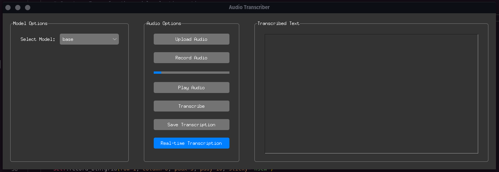

# Transcriber App


The Audio Transcriber app is a real-time audio transcription tool that allows users to upload audio files or record audio in real-time and get the transcribed text using the Whisper speech recognition model. The app is built using Python and Tkinter for the GUI, and it utilizes the Whisper model for transcription.

## Features

- Upload Audio: Users can upload audio files in WAV or MP3 format for transcription.
- Record Audio: Users can record audio in real-time using their microphone and get the transcription as they speak.
- Real-time Transcription: The app provides a real-time transcription feature that continuously updates the transcription text as the user speaks and pauses during recording.
- Transcribe Button: Users can transcribe the uploaded audio file using the Whisper model.
- Save Transcription: Users can save the transcribed text as a text file.

## Setup Instructions

1. Clone the repository to your local machine:
```
git clone https://github.com/your_username/audio-transcriber.git
```
2. Install the required dependencies using pip: 
```
pip3 install -r requirements.txt
```
3. Run the app:
```
python tk_app.py
```
4. The app window will appear, allowing you to use the various features for audio transcription.

Note: The app requires an internet connection to download the Whisper model for transcription.

## Requirements

- Python 3.x
- Tkinter
- sounddevice
- numpy
- whisper
- torch
- soundfile
- pygame
- speech_recognition

5. Make an executable using pyinstaller
```
pyinstaller --onefile tk_app.py
```


